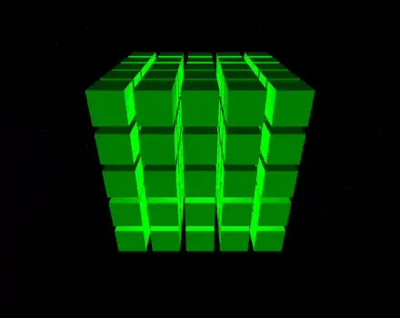

# Qt 3D QML animation of a pack of cubes stretching

This QML code generates a pack consisting of 5x5x5 cubes and animates its stretching and contraction by individually moving each cube radially from the origin.

 Screencast 

## Build instructions

The project was created using Qt Design Studio and requires Qt 6.6 or higher. To build the executable, you can use CMake:

    mkdir build
    cd build
    cmake ..
    make

If Qt is installed locally, use `CMAKE_PREFIX_PATH` to specify the location of Qt's CMake modules:

    cmake -DCMAKE_PREFIX_PATH=~/Qt/6.6.0/gcc_64/lib/cmake ..
